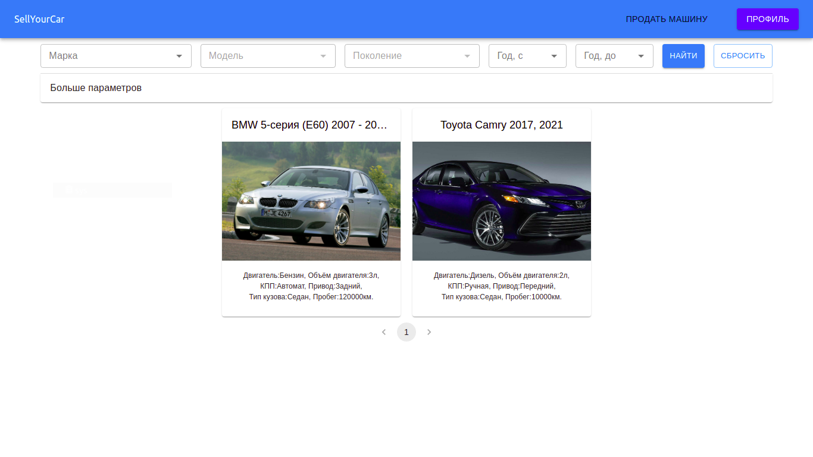
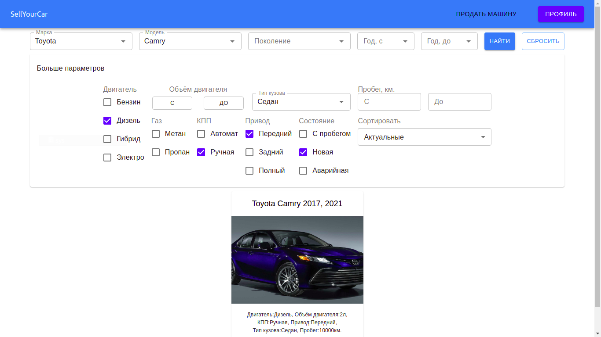
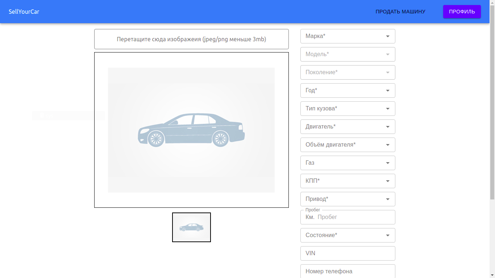
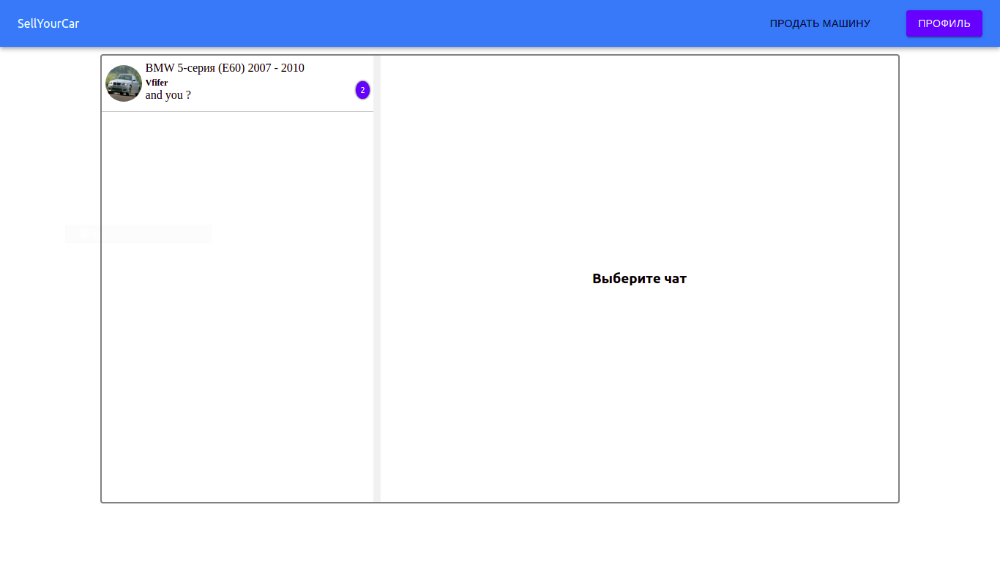

My demo project witch runs on google compute engine - http://35.242.214.67:5000  
login - user 
password - asd123 
Swagger api http://35.242.214.67:8080/swagger-ui.html  
<pre>
Stack:
    Backend: Java 8
             Spring Boot
             Spring Security
             Spring MVC
             Spring Data JPA
             Websockets (Spring websocket)
             JMS (Spring Mail)
             Liquibase
             Spring doc
    Database: MySQL (google cloud platforms SQL)
    Frontend: HTML/CSS/JS
              React
              Redux
              React Router
              Axios
</pre>
Screenshots:

